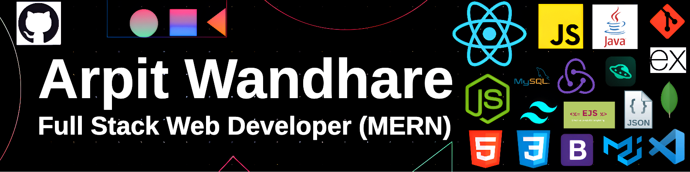

<h1 align='center'>

</h1>

<h3 align='center'>
  Software Engineer | Full Stack Web Developer (MERN) | Java & DSA Enthusiast
</h3>

  

 

## 👨‍💻 About Me
- 🎓 B.Tech in Computer Technology (2025) | Passionate about building full stack web apps using the MERN stack.
- 💻 Proficient in Java, DSA, and MERN Stack.
- 🚀 Actively seeking entry-level opportunities as a Software Engineer/Developer to contribute and grow.

## 💻 Languages and Tools:

## 🚀 Featured Projects

| Project | Stack | Description |
|--------------------|----------|---------------|
| 📷 [Photography Sidebar UI](https://github.com/ArpitWandhare/photography-sidebar-ui) | HTML, CSS | Sidebar layout for a photography-themed landing page with hover effects and menu transitions |

## 🔰 Let's Connect:

---

✨ Thanks for visiting my profile ✨

